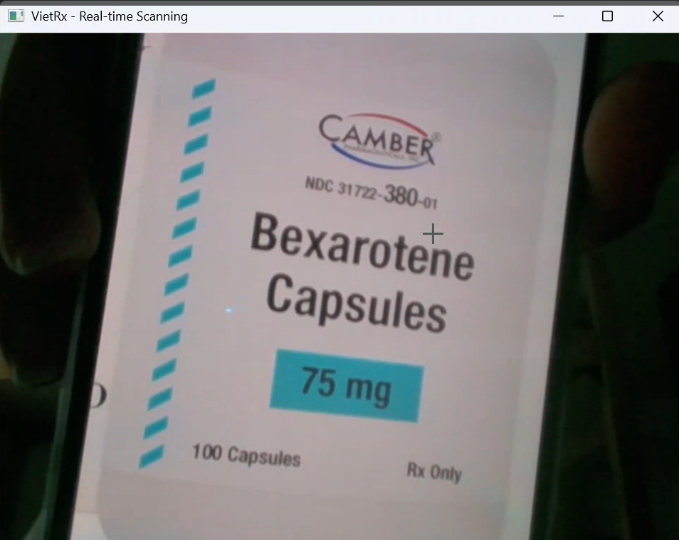
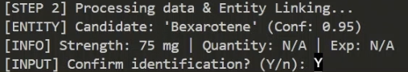

<p align="center">
  
</p>

# VietRx Helper: Multimodal Assistive Technology for Pharmaceutical Label Interpretation

> **Abstract:** This project presents a safety‑oriented, multimodal AI system designed to mitigate health‑literacy barriers for Vietnamese immigrants. The system integrates real‑time Computer Vision (YOLOv8, EasyOCR), Retrieval‑Augmented Generation (RAG) using FDA‑validated datasets, and a Dual‑LLM Audit Architecture to ensure pharmaceutical accuracy and cultural relevance.

---

## 1. Research Objectives and Overview

VietRx Helper is an assistive technology developed to provide elderly users with accurate, culturally adapted interpretations of medication labels. Unlike conventional translation tools, this system prioritizes clinical safety by anchoring Large Language Model (LLM) responses to verified medical databases. The goal is to convert complex pharmacological data into simplified, audible Vietnamese guidance.

---

## 2. Technical Methodology: Dual‑Agent Safety Architecture

To prevent AI hallucinations in medical contexts, the system employs a **Generator–Auditor** (“Doctor–Reviewer”) paradigm:

1. **Generation – Doctor Agent**  
   Uses Google Gemini to synthesize raw OCR text, FDA metadata, and user questions into empathetic Vietnamese advice using respectful honorifics.

2. **Validation – Auditor Agent**  
   A second LLM strictly checks the draft advice against FDA‑derived facts and explicit safety rules (ALLOWED / NOT ALLOWED / SEVERE ERROR).

3. **Conflict Resolution**  
   If the Auditor detects issues (e.g., invented doses, wrong indication, wrong route), the system replaces the draft with a safer, generalized explanation instead of returning potentially harmful content.

---

## 3. Implementation Details: Computer Vision and Entity Extraction

The pipeline combines custom vision with lightweight text processing:

- **Label Localization (YOLOv8)**  
  A fine‑tuned YOLOv8 model detects medication labels on live camera frames.

- **Text Recognition (EasyOCR)**  
  Cropped label regions are passed to EasyOCR to extract raw strings.

- **Fuzzy String Matching**  
  Noisy OCR candidates are linked to the local FDA database using sequence‑similarity scoring (e.g., `difflib` / Levenshtein‑style ratio).

- **Heuristic Metadata Extraction (Regex)**  
  Regular expressions extract:
  - Strength: patterns like `75 mg`, `500 mg`, `10 mL`
  - Quantity: `30 capsules`, `10 tablets`
  - Expiry: `EXP 12/2026`, `HSD 03/25`

These signals feed into the LLM context and help the Auditor enforce safety constraints without turning strength/quantity into a dosing schedule.

---

## 4. System Demonstration

### 4.1 Vision

The webcam captures the medication bottle; YOLOv8 finds the label region, and EasyOCR reads the text.

  
*Figure 1a: Camera capture view.*

  
*Figure 1b: Real‑time identification showing successful detection of Bexarotene.*

### 4.2 Knowledge

Cleaned OCR text is matched against the local FDA knowledge base:

- Fuzzy matching selects the best candidate brand/generic name.
- Regex extracts strength, quantity, and expiry date from the label text.


*Figure 2: Ask for confirmation information.*


### 4.3 Brain

A Dual‑LLM “brain” generates and audits advice:

- **Doctor Agent:** writes short, plain‑language Vietnamese guidance for a ~70‑year‑old.  
- **Auditor Agent:** validates the advice against FDA data and safety rules; if unsafe, it returns a corrected version or a generic warning.


*Figure 3: Dual-LLM generate advice and audit safety.*


### 4.4 Output

The final advice is:

- Printed in the terminal, and  
- Read aloud using Google Text‑to‑Speech (gTTS) in Vietnamese.

*Figure 4a: Advice printed.*

| Vietnamese Output (AI Voice) | English Translation (Academic Context) |
| :--- | :--- |
| “Dạ thưa ạ, thuốc Bexarotene này là một loại thuốc đặc biệt, thuộc nhóm retinoid. Nó thường được các bác sĩ dùng để điều trị một số bệnh về da hoặc một số loại ung thư nhất định, tùy theo tình trạng bệnh của mình. Thuốc này thường được bào chế dưới dạng viên uống, mình sẽ uống bằng miệng theo chỉ dẫn của bác sĩ. Hiện tại, mình có viên 75 miligam. Bác sĩ sẽ hướng dẫn cụ thể cách dùng và liều lượng phù hợp nhất cho bà. Bà nhớ đừng tự ý dùng hay thay đổi liều lượng nha bà.” | “Dear Madam, this medicine Bexarotene is a special drug in the retinoid class. Doctors usually prescribe it to treat certain skin diseases or specific types of cancer, depending on the patient’s condition. It is usually formulated as an oral capsule that you swallow as directed by your doctor. In this case, the capsule strength is 75 milligrams. Your physician will decide how you should take it and the most appropriate dose for you. Please do not change the dose or the way you take it on your own.” |


*Figure 4b: Text is reading by gTTS and extract to file advice.mp3.*

---

## 5. Operational Workflow and Installation

### 5.1 System Requirements

- **Environment:** Python 3.10+  
- **Dependencies:** `ultralytics`, `easyocr`, `opencv-python`, `google-genai`, `gTTS`, `python-dotenv`, `requests` (see `requirements.txt`).

### 5.2 Setup

1. Create and activate a virtual environment (recommended).  
2. Install dependencies:

   ```bash
   pip install -r requirements.txt
